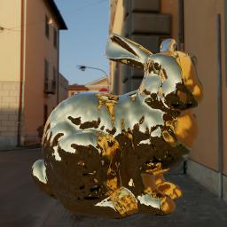
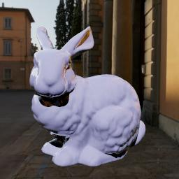

This is a ray-tracer implemented almost entirely in an OpenGL ES fragment shader.  It features triangles, a BVH built at load time, physically based materials, and HDR environment maps.

 

It runs on MacOS and requires GLFW and FreeImagePlus.  Build it using ```make```.

Run it like so:

```
./ray model environment
```

For models and environment images, check out https://github.com/bradgrantham/scene-data .  Try models/bunny.trisrc (may need to be uncompressed after checking out) and images/pisa.hdr.

The pointer moves the object by default.  Press SHIFT to zoom in and out.  Press 'l' to switch to rotating the light (visible on diffuse models) and 'o' to switch back to moving the object.

Press 'm' to cycle through materials.  For the last material in the list, which is a diffuse glazed plaster-like material, press 'd' to cycle through diffuse material colors.

Press 's' to save a screenshot to the file "color.ppm".
